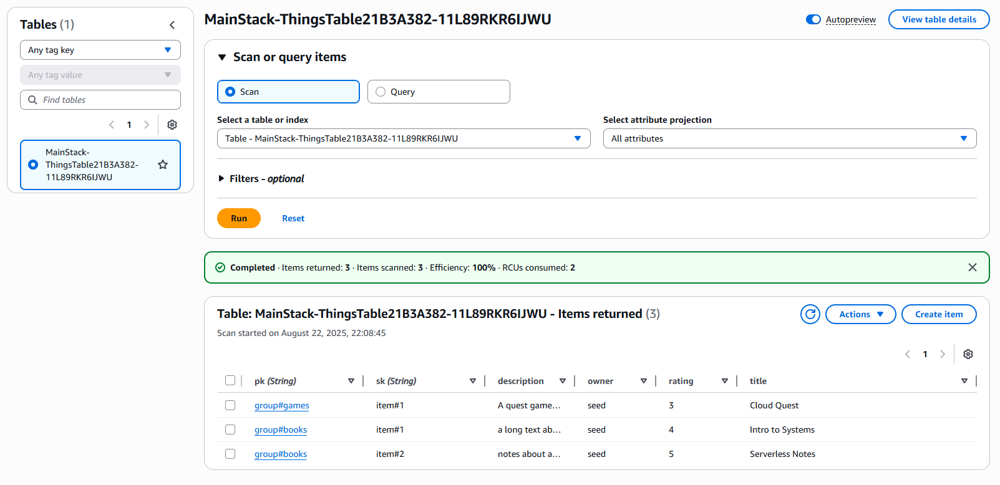
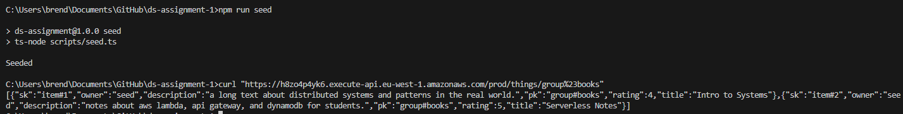
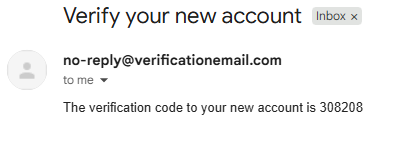
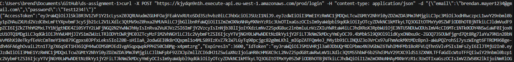
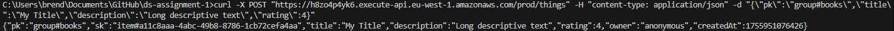
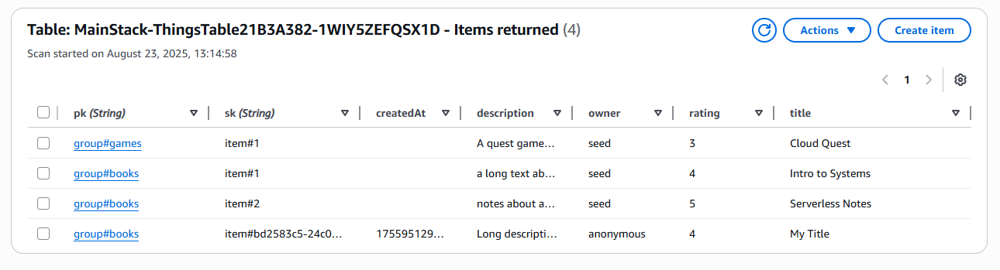

## Commit Log

### - Commit 1
I set up a basic CDK TypeScript project. It builds and can synthesize an empty stack. Nothing is deployed yet.

### - Commit 2 
I added a DynamoDB table with a composite key: pk and sk. I wrote a small seed script that inserts a few test items with a numeric rating and long description text.

### - Commit 3
I created the App API and added a GET route that returns all items for a given pk. This endpoint is public and helps verify the table and data.

### - Commit 4
I added Cognito for sign up and login. There is a basic Auth API with signup, confirm, login, and logout. This gives me tokens I can use later to protect routes.

### - Commit 5
I added POST /things to create items. For now it is public so I can test quickly. It writes an item with a rating and long description.

